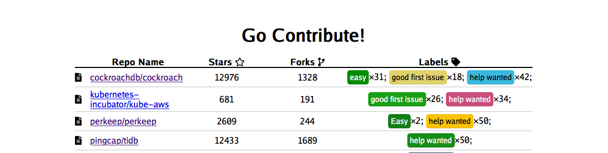

# Go Contribute!

Go Contribute is a server that scans github, showing you the repositories that have the most issues labeled inviting contribution. The server stores the data on an sqlite database. Setup is extremely simple: run the code setting the `GC_DB_DIR` environment variable to choose the location of the sqlite database (defaults to a `tmp_db` directory relative to the running program), `GC_LANG` to select the language you want to scan (defaults to 'go'), and `GC_TOKEN` the **required** env var for your github api token.
